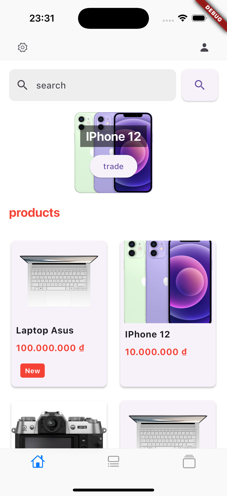
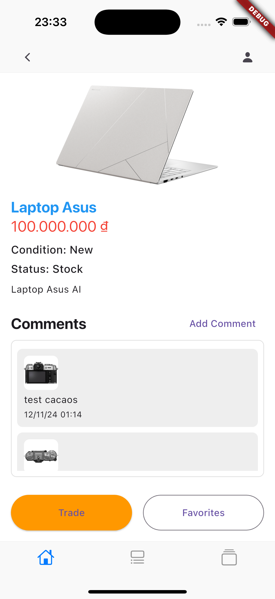

# p2p_exchange

Giới Thiệu:
P2P Exchange là ứng dụng trao đổi đồ/mua bán đồ cũ, tại đây người bán/trao đổi sẽ thực hiện post bài đăng và người có nhu cầu mua/trao đổi sẽ trao đổi trực tiếp với nhau qua ứng dụng và tiến hành trao đổi.
chức năng: 
1. **người bán/trao đổi**
   - sẽ đăng nhập vào hệ thống, đăng bài.
   - menu của người bán bao gồm: Đang bán, Tất cả, Yêu thích, Đang giao dịch
3. **người mua/trao đổi**
   -  đăng nhập vào hệ thống sau đó tìm kiếm sản phẩm mong muốn, chọn sản phẩm và tiến hành trao đổi với chủ sở hửu.
   -  sau khi chọn sản phầm muốn giao dịch và chọn tiến hành giao dịch, sản phẩm này sẽ được thêm vào danh sách đang tiến hành giao dịch của người dùng.
   -  2 bên sẽ thảo luận trực tiếp qua phần trao đổi của sản phẩm và tiến hành giao dịch (hiện tại app chưa cung cấp phương thức xác nhận giao dịch vào giao hàng)

Link Present: https://docs.google.com/presentation/d/1TpqmDt8q7elZBCBKB2JXmGzCoxOMeqN_/edit?usp=drive_link&ouid=114640800113829062639&rtpof=true&sd=true

# Flutter App

Welcome to the Flutter App! This guide will help you set up and build the project on your local machine.

---

## Prerequisites

Ensure you have the following installed:

1. **Flutter SDK**  
   [Install Flutter SDK](https://flutter.dev/docs/get-started/install)  
   Verify your installation with:

   ```bash
   flutter doctor
   ```

2. **Dart SDK** (Installed with Flutter)

3. **Android Studio** (or another IDE like VS Code)

   - Install the Flutter and Dart plugins.
   - Set up the Android emulator.

4. **Xcode** (For iOS development - macOS only)

5. **Device or Emulator**
   - Android: Use an emulator or a physical device in developer mode.
   - iOS: Use a simulator or a connected device.

---

## Getting Started

1. **Clone the repository**

   ```bash
   git clone <repository-url>
   cd <repository-folder>
   ```

2. **Install dependencies**  
   Run the following command to fetch all necessary packages:

   ```bash
   flutter pub get
   ```

3. **Configure Environment**
   - Create a `.env` file if environment-specific configurations are required.
   - Add any API keys or configurations as needed.

---

## Running the App

### On Android:

1. Connect an Android device or start an emulator.
2. Run:
   ```bash
   flutter run
   ```

### On iOS:

1. Open the project in Xcode and configure the signing settings for your team.
2. Run:
   ```bash
   flutter run
   ```

---

## Building the App

### Android:

Build an APK:

```bash
flutter build apk
```

Build an App Bundle:

```bash
flutter build appbundle
```

### iOS:

Build the iOS app:

```bash
flutter build ios
```

Make sure to open the project in Xcode to archive and submit it to the App Store.

---

## Troubleshooting

- Run `flutter doctor` to check for any missing dependencies or errors.
- For detailed debugging, use `flutter logs`.

---

## Resources







